# This document will help you to install Redhat Openshift manually

## infra information


## infra readiness

Login to your fedora workstation and setup the infra readiness tasks

```
root@hypervisor:~# mkdir -p ocp
root@hypervisor:~# kcli create pool -p /var/lib/libvirt/images default
root@hypervisor:~/ocp# wget https://dl.rockylinux.org/pub/rocky/9/images/x86_64/Rocky-9-GenericCloud-Base.latest.x86_64.qcow2
Rocky-9-GenericCloud 100% [======================================================================================================================================>]  576.00M    2.99MB/s
                          [Files: 1  Bytes: 576.00M [3.39MB/s] Redirects: 0  Todo: 0  Errors: 0                                                                   ]    1.97MB/s          
root@hypervisor:~/ocp#
root@hypervisor:~/ocp# mv Rocky-9-GenericCloud-Base.latest.x86_64.qcow2 /var/lib/libvirt/images/
root@hypervisor:~/ocp# cd /var/lib/libvirt/images
root@hypervisor:/var/lib/libvirt/images# chown qemu:qemu Rocky-9-GenericCloud-Base.latest.x86_64.qcow2
root@hypervisor:/var/lib/libvirt/images# 
```

## Creating Networking:

### Creating Virtual Network Bridges: 
The virual environment will comprise a virtual machine that will act as our jumphost server (or Bastion, as its commonly called), and one or more VMs that will be used to install the OpenShift Cluster. 

```
kcli create network -c 192.168.125.0/24 -P dhcp=false --domain ocp.deployment.lab ocp-nat
```


## Creating bootstrap VM 

### Bootstrap VM  and it's services

In OCP installation,  DNS is important, so I am setting up a DNS server on the bootstrap VM, while creating the VM itself and also considered creating all the required files and dir. 

here is the kcli file to be used for single node hub cluster with one bootstrap vm. 

```
root@hypervisor:~# pwd
/root
root@hypervisor:~# mkdir ocp -p 
root@hypervisor:~# cd ocp
root@hypervisor:~/ocp# 
```
```
cat << EOF > bootstrap.yaml
bootstrap:
  pool: default
  rootpassword: redhat
  image: centos9stream
  numcpus: 2
  memory: 4096
  nets:
  - name: ocp-nat
    nic: eth0
    ip: 192.168.125.11
    mask: 255.255.255.0
    gateway: 192.168.125.1
    dns:
    - 192.168.125.11
    - 192.168.0.1
    search: ocp.deployment.lab
  files:
  - path: /etc/motd
    content: Welcome to the bootstrap node, root passwd is redhat
  - path: /etc/named/zones/db.ocp.deployment.lab
    content: |
      \$TTL 86400
      @   IN  SOA     ns1.ocp.deployment.lab. root.ocp.deployment.lab. (
                          2024082101 ; Serial
                          3600       ; Refresh
                          1800       ; Retry
                          604800     ; Expire
                          86400 )    ; Minimum TTL

          IN  NS      ns1.ocp.deployment.lab.

      ns1                 IN  A       192.168.125.11
      api.hub                 IN  A       192.168.125.9
      api-int.hub             IN  A       192.168.125.9
      quay.hub                IN  A       192.168.125.10
      bootstrap           IN  A       192.168.125.11
      hub01.hub               IN  A       192.168.125.9
      hub02.hub               IN  A       192.168.125.8
      hub03.hub               IN  A       192.168.125.7
      app01.hub               IN  A       192.168.125.6

      ; Wildcard entry for apps subdomain
      *.apps.hub              IN  A       192.168.125.9

  - path: /etc/named/zones/db.192.168.125
    content: |
      \$TTL 86400
      @   IN  SOA     ns1.ocp.deployment.lab. root.ocp.deployment.lab. (
                          2024082101 ; Serial
                          3600       ; Refresh
                          1800       ; Retry
                          604800     ; Expire
                          86400 )    ; Minimum TTL

          IN  NS      ns1.ocp.deployment.lab.

      9   IN  PTR     api.hub.ocp.deployment.lab.
      9   IN  PTR     api-int.hub.ocp.deployment.lab.
      9   IN  PTR     apps.hub.ocp.deployment.lab.
      10  IN  PTR     quay.ocp.deployment.lab.
      11  IN  PTR     bootstrap.ocp.deployment.lab.
      11  IN  PTR     ns1.hub.ocp.deployment.lab.
      9   IN  PTR     hub01.hub.ocp.deployment.lab.
      8   IN  PTR     hub02.hub.ocp.deployment.lab.
      7   IN  PTR     hub03.hub.ocp.deployment.lab.
      6   IN  PTR     app01.hub.ocp.deployment.lab.
  - path: /etc/named.conf
    content: |
      // named.conf
      //
      // Provided by Red Hat bind package to configure the ISC BIND named(8) DNS
      // server as a caching only nameserver (as a localhost DNS resolver only).
      //
      // See /usr/share/doc/bind*/sample/ for example named configuration files.
      //
      // See the BIND Administrator's Reference Manual (ARM) for details about the
      // configuration located in /usr/share/doc/bind-{version}/Bv9ARM.html

      options {
        listen-on port 53 { 127.0.0.1; 192.168.125.11; };
      #	listen-on-v6 port 53 { ::1; };
        directory 	"/var/named";
        dump-file 	"/var/named/data/cache_dump.db";
        statistics-file "/var/named/data/named_stats.txt";
        memstatistics-file "/var/named/data/named_mem_stats.txt";
        recursing-file  "/var/named/data/named.recursing";
        secroots-file   "/var/named/data/named.secroots";
        allow-query     { any; };
      #	allow-query     { localhost; 192.168.0.0/24; };

        /*
        - If you are building an AUTHORITATIVE DNS server, do NOT enable recursion.
        - If you are building a RECURSIVE (caching) DNS server, you need to enable
          recursion.
        - If your recursive DNS server has a public IP address, you MUST enable access
          control to limit queries to your legitimate users. Failing to do so will
          cause your server to become part of large scale DNS amplification
          attacks. Implementing BCP38 within your network would greatly
          reduce such attack surface
        */
        recursion yes;

      #	dnssec-enable yes;
        dnssec-validation yes;

        # Using Google DNS
        forwarders {
                      8.8.8.8;
                      8.8.4.4;
              };

        /* Path to ISC DLV key */
        bindkeys-file "/etc/named.root.key";

        managed-keys-directory "/var/named/dynamic";

        pid-file "/run/named/named.pid";
        session-keyfile "/run/named/session.key";
      };

      logging {
              channel default_debug {
                      file "data/named.run";
                      severity dynamic;
              };
      };

      zone "." IN {
        type hint;
        file "named.ca";
      };

      # Include ocp zones

      zone "ocp.deployment.lab" {
          type master;
          file "/etc/named/zones/db.ocp.deployment.lab";
          allow-update { none; };
      };

      zone "125.168.192.in-addr.arpa" {
          type master;
          file "/etc/named/zones/db.192.168.125";
          allow-update { none; };
      };

      include "/etc/named.rfc1912.zones";
      include "/etc/named.root.key";
  cmds:
  - echo "PermitRootLogin yes" >> /etc/ssh/sshd_config
  - ssh-keygen -t rsa -b 4096 -N '' -f ~/.ssh/id_rsa
  - systemctl restart sshd
  - dnf install -y podman bind-utils nmstate httpd
  - dnf -y install podman httpd-tools runc wget nmstate containernetworking-plugins bind bind-utils bash-completion tree net-tools
  - systemctl disable firewalld iptables
  - systemctl stop firewalld iptables
  - chown -R named:named /etc/named ; chmod -R 755 /etc/named 
  - chown -R named:named /etc/named.conf ; chmod -R 755 /etc/named.conf
  - systemctl enable --now named
  - systemctl restart named
  - echo "search ocp.deployment.lab" >> /etc/resolv.conf
EOF
```

```
cat << EOF > hub.yaml
hub:
 pool: default
 uefi: true
 start: false
 numcpus: 16
 memory: 48000
 disks:
 - size: 200
 - size: 300
 nets:
 - name: ocp-nat
   nic: eth0
   mac: 52:54:00:35:bb:80
   ip: 192.168.125.9
   mask: 255.255.255.0
   gateway: 192.168.125.1
EOF
```

list the files here 

```
root@hypervisor:~# cd ocp/
root@hypervisor:~/ocp# ll
total 12
-rw-r--r--. 1 root root 5654 Aug 22 03:20 bootstrap.yaml
-rw-r--r--. 1 root root  241 Aug 21 16:00 hub.yaml
root@hypervisor:~/ocp# 
```

now create bootstrap and hub vm's, note: hub vm remains power off. 

```
kcli create plan -f bootstrap.yaml 
kcli create plan -f hub.yaml 

root@hypervisor:~/ocp# kcli list vm 
+-----------+--------+----------------+---------------+-----------------+---------+
|    Name   | Status |       Ip       |     Source    |       Plan      | Profile |
+-----------+--------+----------------+---------------+-----------------+---------+
| bootstrap |   up   | 192.168.125.11 | centos9stream |  summer-spidey  |  kvirt  |
|    hub    |   up   | 192.168.125.9  |               | prickly-sampras |  kvirt  |
+-----------+--------+----------------+---------------+-----------------+---------+
root@hypervisor:~/ocp# 

```
login to bootstrap VM and validate the dns server status 

```
root@hypervisor:~/ocp# ssh 192.168.125.11
Welcome to the bootstrap node, root passwd is redhat
Activate the web console with: systemctl enable --now cockpit.socket

Last login: Thu Aug 22 05:17:06 2024 from 192.168.125.1
[root@bootstrap ~]# nslookup 192.168.125.11
11.125.168.192.in-addr.arpa	name = ns1.ocp.deployment.lab.
11.125.168.192.in-addr.arpa	name = bootstrap.ocp.deployment.lab.

[root@bootstrap ~]# nslookup 192.168.125.9
9.125.168.192.in-addr.arpa	name = hub01.ocp.deployment.lab.
9.125.168.192.in-addr.arpa	name = apps.hub.ocp.deployment.lab.
9.125.168.192.in-addr.arpa	name = api.hub.ocp.deployment.lab.
9.125.168.192.in-addr.arpa	name = api-int.ocp.deployment.lab.
9.125.168.192.in-addr.arpa	name = api.ocp.deployment.lab.

[root@bootstrap ~]# 
```

## Installing OpenShift Client, Installer  and Mirror Plugin

```
curl https://mirror.openshift.com/pub/openshift-v4/x86_64/clients/ocp/4.14.18/openshift-client-linux-4.14.18.tar.gz -o openshift-client-linux-4.14.18.tar.gz
tar -xvf openshift-client-linux-4.14.18.tar.gz
mv oc /usr/bin/
mv kubectl /usr/bin/
rm -f openshift-client-linux-4.14.18.tar.gz
oc completion bash > oc.bash_completion
mv oc.bash_completion /etc/bash_completion.d/
#
curl https://mirror.openshift.com/pub/openshift-v4/x86_64/clients/ocp/4.14.18/openshift-install-linux-4.14.18.tar.gz -o openshift-install-linux-4.14.18.tar.gz
tar -xvf ./openshift-install-linux-4.14.18.tar.gz
rm -f openshift-install-linux-4.14.18.tar.gz Read*
mv openshift-install /usr/bin/

# 
```

## create the installation config files 

```
cat << EOF > install-config.yaml
apiVersion: v1
baseDomain: ocp.deployment.lab
compute:
- architecture: amd64
  hyperthreading: Enabled
  name: worker
  replicas: 0
controlPlane:
  architecture: amd64
  hyperthreading: Enabled
  name: master
  replicas: 1
metadata:
  creationTimestamp: null
  name: hub
networking:
  clusterNetwork:
  - cidr: 10.128.0.0/14
    hostPrefix: 23
  machineNetwork:
  - cidr: 192.168.125.0/24
  networkType: OVNKubernetes
  serviceNetwork:
  - 172.30.0.0/16
platform:
  none: {}
pullSecret: ''
sshKey: |
EOF
```

Note: We have open the console.redhat.com and click on the download menu to download the pull secret.

```
vi install-config.yaml
```

Add the ssh key to be able to access the deployed clsuter node (if needed at some point for debugging):

```
echo -n "  " >> install-config.yaml
cat ~/.ssh/id_rsa.pub >> install-config.yaml
```

now create agent-config.yaml file as below 

```
cat << EOF >> agent-config.yaml
apiVersion: v1alpha1
metadata:
  name: hub
rendezvousIP: 192.168.125.9
hosts:
  - hostname: hub01
    interfaces:
     - name: eth0
       macAddress: 52:54:00:35:bb:80
    networkConfig:
      interfaces:
      - name: eth0
        state: up
        ipv4:
          address:
          - ip: 192.168.125.9
            prefix-length: 24
          enabled: true
          dhcp: false
      dns-resolver:
        config:
          server:
            - 192.168.125.11
      routes:
        config:
          - destination: 0.0.0.0/0
            next-hop-address: 192.168.125.1
            table-id: 254
            next-hop-interface: eth0
EOF
```

## Creating & Mounting the ISO file:

All the pieces are ready to start the building of ISO file. Use the following command for that: 

**NOTE** This process removes the two manifests we created earlier. IF those have to be preserved for future observation, make a copy of those at some other location. 

```
mkdir ~/abi 
cp install-config.yaml ~/abi/
cp agent-config.yaml ~/abi/
cd ~/abi
openshift-install agent create image --dir=./ --log-level=debug
```

The logs will end with the following: 
```
DEBUG   Reusing previously-fetched ClusterDeployment Config
DEBUG Generating Kubeconfig Admin Client...
DEBUG Fetching Kubeadmin Password...
DEBUG Reusing previously-fetched Kubeadmin Password
```
An ISO would now have been created. We can go ahead and copy that to the default home directory for the HTTP server, and also enable the HTTP server to start listening on the default http port: 

```
cp agent.x86_64.iso /var/www/html/
systemctl enable httpd --now
sleep 10
systemctl is-active httpd
# should show "active"
```
<!-- FOLLOWING IS NO LONGER NEEDED NOW THAT ISSUE IS FIXED...BUT KEEPING FOR HISTORY

Before proceeding, lets disconnect Basation completeion, so there is no chance that any data is being sourced from internet: 
```
nmcli con down "System eth1"
sleep 10
ip route add default via 192.168.125.1 
sed -i 's/^nameserver 192.168.126.1/nameserver 192.168.125.1/g' /etc/resolv.conf
```

-->

You can now go ahead and mount this ISO the the VM (called `hub`) that was created in an earlier step: 

```
curl -d '{"Image":"http:/192.168.125.11/agent.x86_64.iso","Inserted": true}' -H "Content-Type: application/json" -X POST -k https://192.168.125.1:9000/redfish/v1/Managers/local/hub/VirtualMedia/Cd/Actions/VirtualMedia.InsertMedia
```

This command calls the sushy api (installed during host buildup, and listening on port 9000). 

To verify that the mounting was successful, exit the VM, and verify by running the following command on the host machine: 

```
[root@hypervisor ~]# virsh dumpxml hub | grep source
      <source file='/var/lib/libvirt/images/hub_0.img'/>
      <source file='/var/lib/libvirt/images/hub_1.img'/>
      <source file='/var/lib/libvirt/images/agent.x86_64.iso'/>
      <source network='tnc'/>
[root@hypervisor ~]#
```

This command shows the availble boot sources for the vm called `hub`. As you can see, the ISO file is listed amount those sources. Its not the first source, but since the other sources don't contain any boot image, its safe to leave the boot operation as-is. (in a production deployment, the boot sequence should be changed to avoid any confusion due to some preexisting image on the local disks)

## Start & Monitor the installation: 

As soon as the hub VM boots from the mounted ISO file, it will start the Agent Based Installation Process. To achieve that, and being able to monitor the console, we will use graphical console available through Cockpit. 

Cockpit was already enabled in the earlier steps. Lets now connect to it by pointing your browser to the IP address of the Host on port 9090. Login using the user credentials provided for the host. 

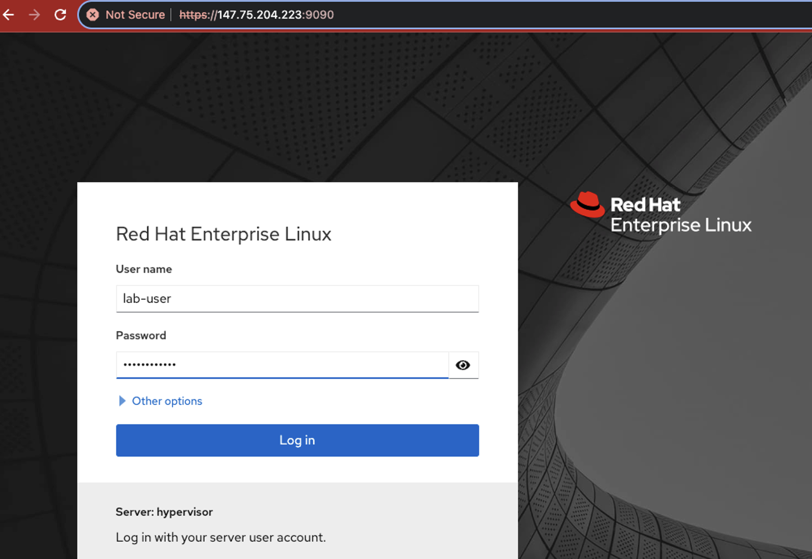

By default, the login screen has restricted view. To change that, click on the "Limited Access" button on the top, as shown here: 

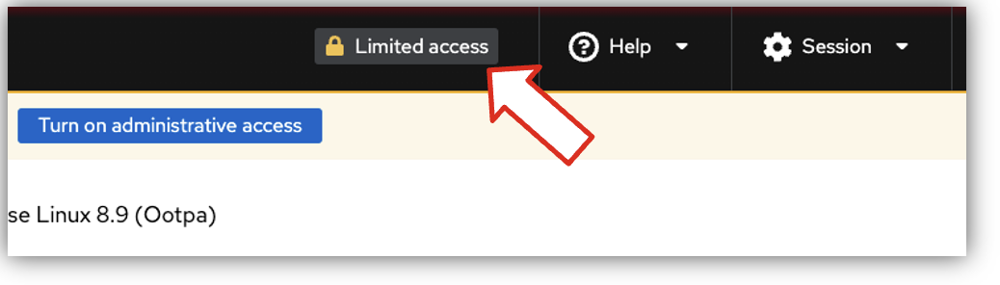

This will enable the Administrative access view, as shown here: 

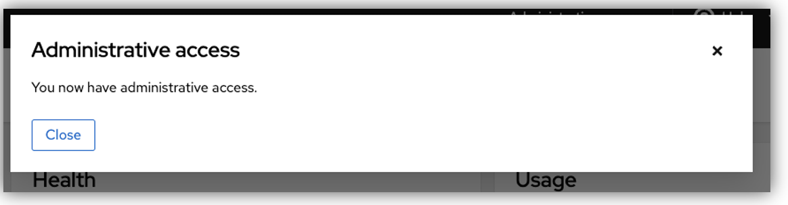

On this view, select "Virtual Machines" from the left hand side menue. This will show you the configured VMs. 

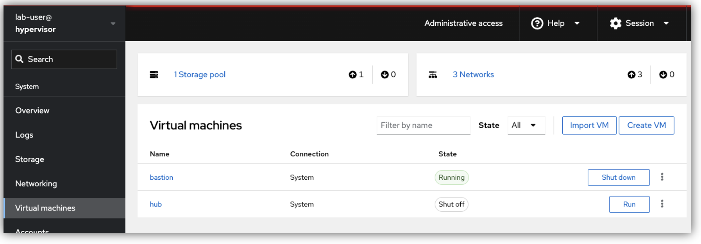

Select "hub"
On the next screen, you can re-verify if the ISO is properly mounted as can be seen here: 

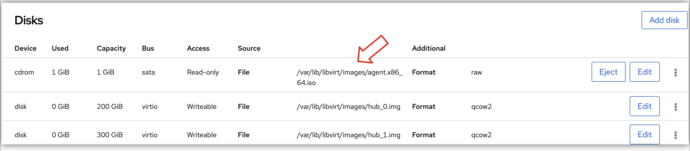

Lets go ahead and. press "RUN"

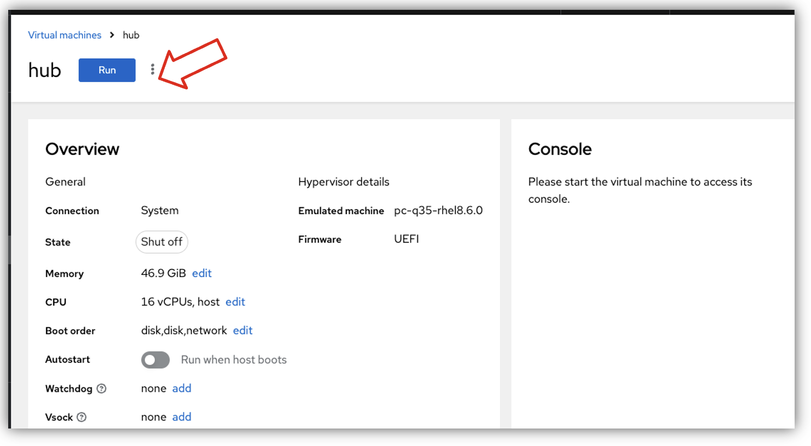

The node will now go through RHCOS Boot stages. A visual of that is shown here: 

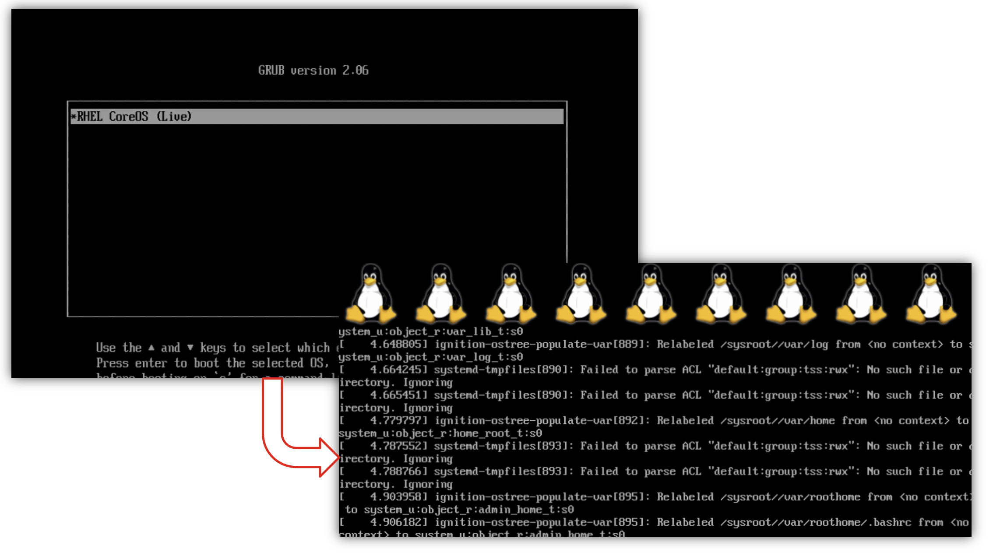

Next, it will perform connectivity checks. This may take a little while: 

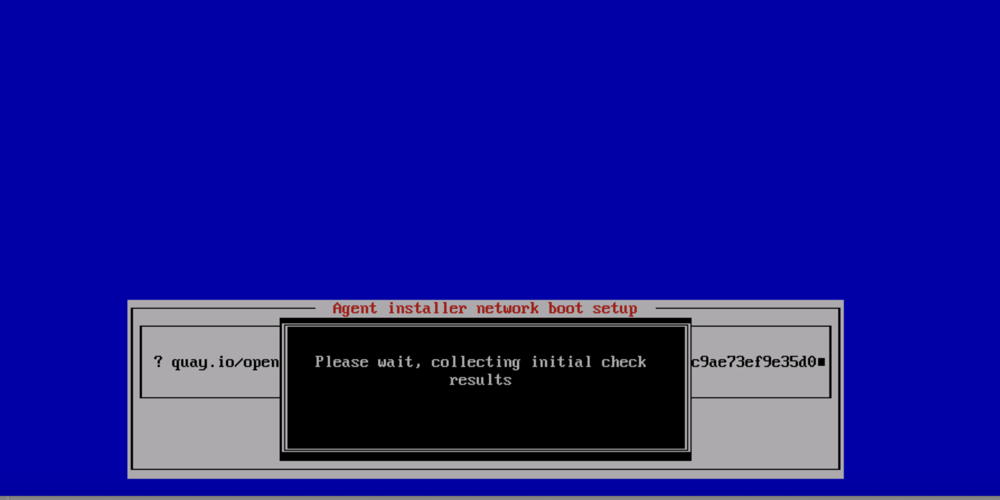

If this passes, then the console will proceed to the next screen that gives yuu the opportunity to interrupt and modify netweorking configuration: 

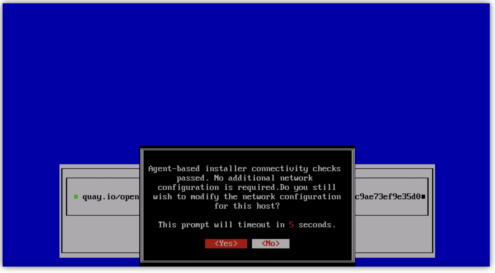

In case the connectivity check etc. don't go well, you will see the failure reported. An example of such a failure is included here: 

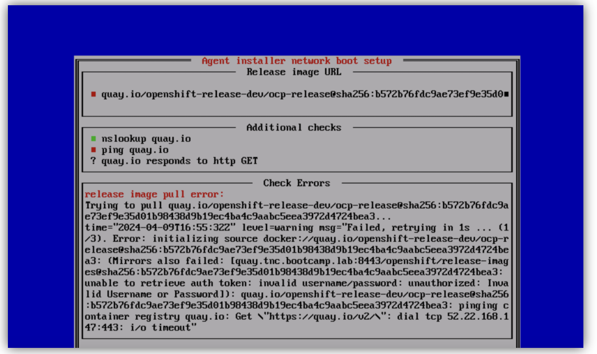

If there isn't any error, then you will soon see a login prompt for the cluster, like the one here: 

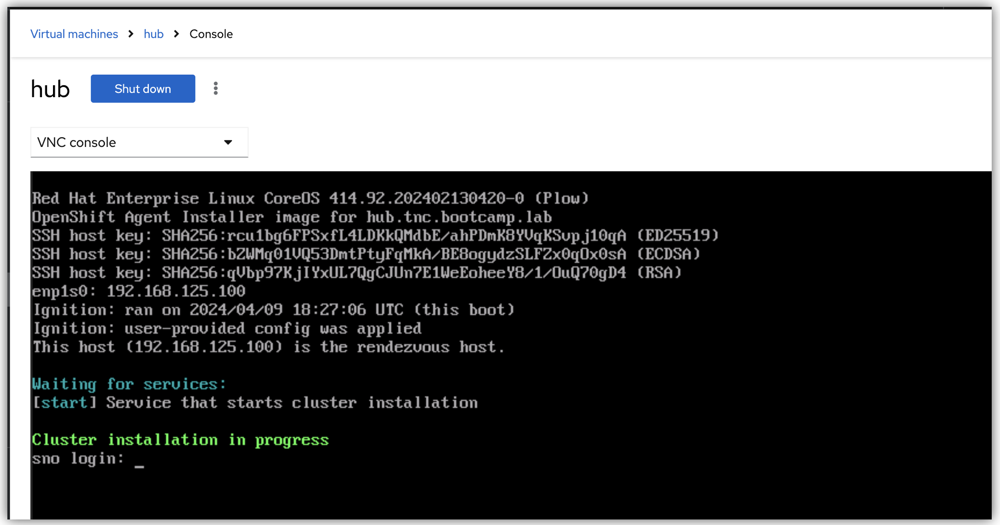

Cluster is not yet deployed. Its still in progres, and will take some time to complete. 


# TODO:
- show oc get nodes 
- Check status of ICSP and CS ...add operators

### Monitor the Installation using CLI:

You can continue to monitor using console, or you can choose to monitor the pogress using command line using the following commnad (from inside the Bastion VM) to monitor progress:

```
openshift-install agent wait-for install-complete --log-level=debug --dir=/root/abi/
```
The output will end with the following:
```
DEBUG asset directory: /root/abi/                  
DEBUG Loading Agent Config...                      
DEBUG Using Agent Config loaded from state file    
DEBUG Loading Agent Manifests...                   
DEBUG   Loading Agent PullSecret...                
DEBUG     Loading Install Config...  
<<SNIP>>
DEBUG RendezvousIP from the AgentConfig 192.168.125.100 
INFO Bootstrap Kube API Initialized               
INFO Bootstrap configMap status is complete       
INFO cluster bootstrap is complete                
DEBUG Still waiting for the cluster to initialize: Working towards 4.14.18: 562 of 860 done (65% complete) 
DEBUG Still waiting for the cluster to initialize: Working towards 4.14.18: 69 of 860 done (8% complete) 
DEBUG Still waiting for the cluster to initialize: Working towards 4.14.18: 364 of 860 done (42% complete) 
DEBUG Still waiting for the cluster to initialize: Working towards 4.14.18: 74 of 860 done (8% complete) 
DEBUG Still waiting for the cluster to initialize: Working towards 4.14.18: 599 of 860 done (69% complete)
<<SNIP>>
DEBUG Still waiting for the cluster to initialize: Cluster operator openshift-samples is not available 
INFO Cluster is installed                         
INFO Install complete!                            
INFO To access the cluster as the system:admin user when using 'oc', run 
INFO     export KUBECONFIG=/root/abi/auth/kubeconfig 
INFO Access the OpenShift web-console here: https://console-openshift-console.apps.hub.tnc.bootcamp.lab 
INFO Login to the console with user: "kubeadmin", and password: "agwwb-DjcFP-WV6Xo-G29Fm" 
```

Your disconnected cluster is now up and running! 

Note that the very last lines in the log indicate the KUBECONFIG path, as well as `kubeadmin` credentials. 

## Acessing the cluster: 

```
mkdir ~/.kube
cp ~/abi/auth/kubeconfig ~/.kube/config
```

```
oc get nodes
NAME   STATUS   ROLES                         AGE   VERSION
sno    Ready    control-plane,master,worker   17m   v1.27.11+749fe1d
oc get clusterversion
NAME      VERSION   AVAILABLE   PROGRESSING   SINCE   STATUS
version   4.14.18   True        False         4m8s    Cluster version is 4.14.18
```

<!--
## Some other useful snippets for later use: 
```
grub:
console=tty0 console=ttyS0
OR
console=ttyS0,115200 console=tty0
virsh dumpxml hubvm | grep source


virsh start --console hubvm

curl -X PATCH -H 'Content-Type: application/json' -d '{
      "Boot": {
          "BootSourceOverrideTarget": "Cd",
          "BootSourceOverrideMode": "Uefi",
          "BootSourceOverrideEnabled": "Continuous"
      }
    }' -k https://127.0.0.1:9000/redfish/v1/Systems/local/abinode


~             
```
-->
