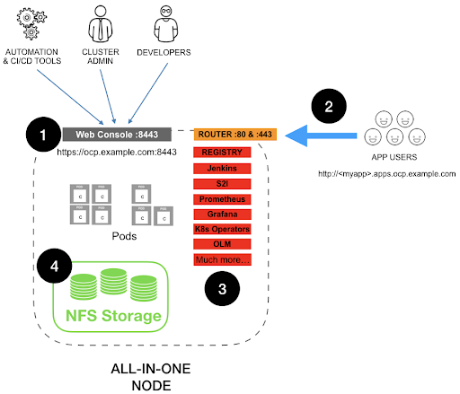

# Installing Openshift on a disconnected infra with single node setup

This lab guide uses a baremetal server to deomonstrate the deployment of Openshift in a fully disconnected infra using ABI (Agent based installer)

1) infra readiness
    * Workstation installation and it's configuration
    * DNS configuration
    * [Architecture Diagram](#architecture-diagram)
2) OCP installation
    * Installing the mirror-registry
    * Mirroring Openshift image and operators to the local image registry
    * Genering an ISO file and booting the OpenShift Node(s) with the ISO

## Workstation installation and configuration

I do have HP workstation z420(Very old bad guy)loaded with below hw configuration and it's enough to test OCP installation

```Processors: 2x (3.00 GHz) 10-Core Intel Xeon E5-2690V2 Processors [multi threading enabled, so total 40 vcps]
Memory (RAM): 256GB (8x32GB) DDR3 PC3 R Memory
Drive 1: 3TB HDD SATA 7.2k 3.5" Hard Drive - OS installed drive with LVM
Drive 2: 512GB SSD SATA 6GB/s 2.5" Solid State Drive 
Drive 3: 3TB HDD SATA 7.2k 3.5" Hard Drive
Drive 4: 3TB HDD SATA 7.2k 3.5" Hard Drive
Graphics Card: Nvidia Quadro K620 2GB DDR3 (DVI, DisplayPort)
Operating System: Fedora Workstation 40
```


## Architecture Diagram




